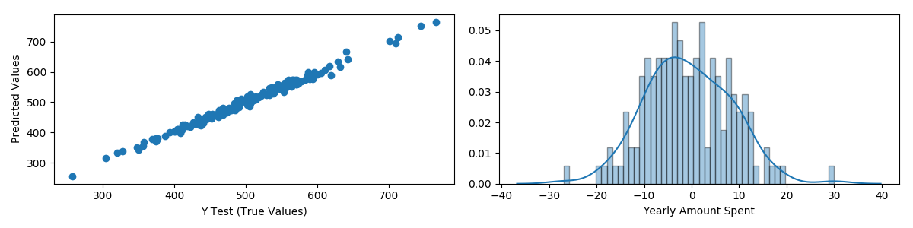

# Udemy

## Advance CSS and Sass Course

Advance CSS and Sass Course folder is based on the starter package from [Jonas Schmedtmann](https://github.com/jonasschmedtmann/advanced-css-course). The folder contains three projects that have been completed.

The Natours Project requires npm for SCSS compilation.

to view the site `npm install live-server -g` and `live-server` the project.

---

## Complete Python Masterclass

[Tim](http://learnprogramming.academy)

---

## Python for Data Science and Machine Learning

Course uses [jupyter](http://jupyter.org/install).

run `jupyter notebook` within the course directory.

I use [Homebrew](#) to install [pyenv](https://anil.io/blog/python/pyenv/using-pyenv-to-install-multiple-python-versions-tox/) that controls my python environment.

Packages covered in the course:
[numpy](http://www.numpy.org)
[pandas](http://pandas.pydata.org)
[matplotlib](http://www.matplotlib.org/)
[seaborn](https://seaborn.pydata.org)
[plotly-2.7.0](https://plot.ly)
[cufflinks](https://github.com/santosjorge/cufflinks)

Example plots with [seaborn](https://seaborn.pydata.org):


### Python Graphing and Data Processing Introduction

<details><summary>Capstone Project</summary>
<p>

```python
import numpy as np
import pandas as pd

import matplotlib.pyplot as plt
import seaborn as sns

# useful for jupter
# %matplotlib inline

# Updated to latest 911 data from kaggle.
df = pd.read_csv('tmp/911.csv')

# displays info about dataframe
# df.info()

# displays top 5 rows from dataframe
# print(df.head(5))

# displays top 5 rows of counts on zip code
# print(df['zip'].value_counts().head())

# displays top 5 rows of counts on township
# print(df['twp'].value_counts().head())

# displays all unique titles
# print(df['title'].nunique())

# lambda expression to split title and capture just a reason EMS, FIRE, TRAFFIC
df['reason'] = df['title'].apply(lambda reason: reason.split(':')[0])

# displays top 1 row of counts on reason column
# print(df['reason'].value_counts().head(1))

# grab fig and ax of subplot - subplot with specific dimension and plot layout 2x2
fig, ax = plt.subplots(2, 2, figsize=(12, 6))

# first plot assigned and axis labels adjusted
s1 = sns.countplot(x='reason', data=df, palette='viridis', ax=ax[0][0])
s1.set(xlabel='Reason', ylabel='Count')

# reassign format of timeStamp column
# print(type(df['timeStamp'].iloc[0]))
df['timeStamp'] = pd.to_datetime(df['timeStamp'])
# print(type(df['timeStamp'].iloc[0]))

# make new columns with hour, month, and dayofweek
# time = df['timeStamp'].iloc[0]
# print(time.hour)
df['hour'] = df['timeStamp'].apply(lambda time: time.hour)
df['month'] = df['timeStamp'].apply(lambda time: time.month)
df['dayofweek'] = df['timeStamp'].apply(lambda time: time.dayofweek)
# print(df.head())

# map the dayofweek column
dmap = {0: 'Mon', 1: 'Tue', 2: 'Wed', 3: 'Thu', 4: 'Fri', 5: 'Sat', 6: 'Sun'}
df['dayofweek'] = df['dayofweek'].map(dmap)
# print(df.head())

# add second plot
s2 = sns.countplot(x='dayofweek', data=df, hue='reason',
                   palette='viridis', ax=ax[0][1])
# plt.legend(bbox_to_anchor=(1.05, 1), loc=2, borderaxespad=0)
# s2.legend_.remove()
s2.set(xlabel='Day of Week', ylabel='Count')
s2.legend(title='Reason')
# s2.set_title('Reason')
# plt.legend(bbox_to_anchor=(1.05, 1), loc=2, borderaxespad=0)

# was third plot
# s3 = sns.countplot(x='month', data=df, hue='reason',
#                    palette='viridis', ax=ax[2])
# s3.set(xlabel='Month', ylabel='Count')
# plt.legend(bbox_to_anchor=(1.05, 1), loc=2, borderaxespad=0)

# fix missing month data as seen in countplots
byMonth = df.groupby('month').count()
# print(byMonth.head(12))

# was third plot
# s3 = sns.lineplot(x='month', y='lat', data=byMonth.reset_index(),
#                   palette='viridis', ax=ax[1][0])
# s3.set(xlabel='Month', ylabel='Latitude')
# s3.legend()
# plt.legend(bbox_to_anchor=(1.05, 1), loc=2, borderaxespad=0)

# was third plot - will append to grid system
# byMonth['lat'].plot()

# new date column
# t = df['timeStamp'].iloc[0]
# print(t.date())
df['date'] = df['timeStamp'].apply(lambda time: time.date())
# print(df.head())

# various groupbys
# print(df.groupby('date').count()['lat'])
# df.groupby('date').count()['lat'].plot()
# df[df['reason'] == 'Traffic'].groupby('date').count()['lat'].plot()
# df[df['reason'] == 'Fire'].groupby('date').count()['lat'].plot()
# df[df['reason'] == 'EMS'].groupby('date').count()['lat'].plot()

# plot 3 and 4 data
dayHour = df.groupby(by=['dayofweek', 'hour']).count()['reason'].unstack()
dayMonth = df.groupby(by=['dayofweek', 'month']).count()['reason'].unstack()
# print(dayHour)

# heatmaps plots 3 and 4
s4 = sns.heatmap(dayHour, cmap='viridis', ax=ax[1][1])
s4.set(xlabel='Hour', ylabel='Day of Week')

s3 = sns.heatmap(dayMonth, cmap='viridis', ax=ax[1][0])
s3.set(xlabel='Month', ylabel='Day of Week')

# independent lmplot
# s5 = sns.lmplot(x='month', y='twp',
#                 data=byMonth.reset_index(), palette='viridis')
# s5.set(xlabel='Month', ylabel='Township')

# independent clustermap
# s4a = sns.clustermap(dayHour, cmap='viridis')
# s4a.set(xlabel='Hour', ylabel='Day of Week')

# tighten up layout
fig.tight_layout()

# add title
fig.suptitle("Emergency - 911 Calls - Montgomery County, PA")

# adjust space for title
fig.subplots_adjust(top=0.9)

# show plot
plt.show()

# save plots
fig.savefig("seaborn_example1.png")
# s5.savefig("seaborn_lmplot_example.png")
```


</p>
</details>

<details><summary>Finance Project</summary>
<p>

```Python
import numpy as np
import pandas as pd
# fix
pd.core.common.is_list_like = pd.api.types.is_list_like

from pandas_datareader import data, wb
import fix_yahoo_finance as yf
import datetime
import arrow

# visual stuff
import matplotlib.pyplot as plt
import seaborn as sns

# turn on edges
plt.rcParams["patch.force_edgecolor"] = True

# load pickle database of bank information
# pd.read_pickle('tmp/all_banks')

# set time variables - 10 years from now
start = arrow.now().shift(years=-12).format('YYYY-MM-DD')
end = arrow.now().format('YYYY-MM-DD')

yf.pdr_override()

# Bank of America
BAC = data.get_data_yahoo("BAC", start, end)

# CitiGroup
C = data.get_data_yahoo("C", start, end)

# Goldman Sachs
GS = data.get_data_yahoo("GS", start, end)

# JP Morgan Chase
JPM = data.get_data_yahoo("JPM", start, end)

# Morgan Stanley
MS = data.get_data_yahoo("MS", start, end)

# Wells Fargo
WFC = data.get_data_yahoo("WFC", start, end)

# setup keys for pd.concat
tickers = ['BAC', 'C', 'GS', 'JPM', 'MS', 'WFC']

# dataframe setup
bank_stocks = pd.concat([BAC, C, GS, JPM, MS, WFC], axis=1, keys=tickers)

# name columns
bank_stocks.columns.names = ['Bank Ticker', 'Stock Info']

# print(bank_stocks.head())
# for tick in tickers:
#     print(tick, bank_stocks[tick]['Close'].max())

# returns max stock close value
# print(bank_stocks.xs(key='Close', axis=1, level='Stock Info').max())

returns = pd.DataFrame()

for tick in tickers:
    returns[tick+' Return'] = bank_stocks[tick]['Close'].pct_change()

# print(returns.head())

# pairplot of all returns - removed first row due to NaN
# sns.pairplot(returns[1:])

# returns single worse loss/best gain
# print(returns.idxmin())
# print(returns.idxmax())

print('*' * 40)

# std deviation
print(returns.std())

print('*' * 40)

# std deviation for 2015
print(returns.loc['2015-01-01':'2015-12-31'].std())

print('*' * 40)

# setup multiple plots
fig, ax = plt.subplots(3, 2, figsize=(12, 8))

# sns.distplot(returns.loc['2015-01-01':'2015-12-31']['MS Return'], color='green', bins=50, hist_kws=dict(edgecolor="k", linewidth=2))
s1 = sns.distplot(returns.loc['2015-01-01':'2015-12-31']
                  ['MS Return'], color='green', bins=50, ax=ax[0][0])
s1.set(xlabel='Morgan Stanley Returns')

s2 = sns.distplot(returns.loc['2008-01-01':'2008-12-31']
                  ['C Return'], color='red', bins=50, ax=ax[0][1])
s2.set(xlabel='CitiGroup Returns')

# lineplot
# for tick in tickers:
#     ax[1] = bank_stocks[tick]['Close'].plot(label=tick)

bank_stocks.xs(key='Close', axis=1, level='Stock Info').plot(ax=ax[1][0])
ax[1][0].legend(loc=1)

# print(bank_stocks.xs(key='Close', axis=1, level='Stock Info'))
# plt.legend()

# s3 = sns.heatmap(data=bank_stocks.xs(key='Close', axis=1, level='Stock Info'), ax=ax[1][0])


# moving averages

BAC['Close'].loc['2008-01-01':'2009-01-01'].rolling(
    window=30).mean().plot(ax=ax[1][1], label='30 day rolling average')
BAC['Close'].loc['2008-01-01':'2009-01-01'].plot(
    ax=ax[1][1], label='BAC Close')
ax[1][1].legend(loc=1)

# correlation of closing/opening stock prices between banks
s4 = sns.heatmap(bank_stocks.xs(key='Close', axis=1,
                                level='Stock Info').corr(), annot=True, ax=ax[2][1])
s4.set(xlabel='Bank', ylabel='Bank')

# s5 = sns.heatmap(bank_stocks.xs(key='Open', axis=1,
#                                 level='Stock Info').corr(), annot=True, ax=ax[2][0])
# s5.set(xlabel='Bank', ylabel='Bank')

# sns.clustermap(bank_stocks.xs(key='Close', axis=1,
#                               level='Stock Info').corr(), annot=True)

C['Close'].loc['2016-01-01':'2017-01-01'].rolling(
    window=30).mean().plot(ax=ax[2][0], label='30 day rolling average')
C['Close'].loc['2016-01-01':'2017-01-01'].plot(
    ax=ax[2][0], label='C Close')
ax[2][0].legend(loc=1)

# tighten up layout
fig.tight_layout()

# add title
fig.suptitle("Finance Report - 6 Major Banks")

# adjust space for title
fig.subplots_adjust(top=0.9)

# show plot
plt.show()

# save plots
fig.savefig("seaborn_example2.png")
```


</p>
</details>

<details><summary>Finance Project Option</summary>
<p>

```python
import numpy as np
import pandas as pd
# fix
pd.core.common.is_list_like = pd.api.types.is_list_like

from pandas_datareader import data
import fix_yahoo_finance as yf
import arrow

# import plotly.plotly as py
import plotly.graph_objs as go

import plotly

from plotly.offline import download_plotlyjs, init_notebook_mode, plot, iplot

import cufflinks as cf

init_notebook_mode(connected=True)
cf.go_offline()

#  set time variables - 10 years from now
start = arrow.now().shift(years=-12).format('YYYY-MM-DD')
end = arrow.now().format('YYYY-MM-DD')

yf.pdr_override()

# Bank of America
BAC = data.get_data_yahoo("BAC", start, end)

# CitiGroup
C = data.get_data_yahoo("C", start, end)

# Goldman Sachs
GS = data.get_data_yahoo("GS", start, end)

# JP Morgan Chase
JPM = data.get_data_yahoo("JPM", start, end)

# Morgan Stanley
MS = data.get_data_yahoo("MS", start, end)

# Wells Fargo
WFC = data.get_data_yahoo("WFC", start, end)

# setup keys for pd.concat
tickers = ['BAC', 'C', 'GS', 'JPM', 'MS', 'WFC']

# dataframe setup
bank_stocks = pd.concat([BAC, C, GS, JPM, MS, WFC], axis=1, keys=tickers)

# name columns
bank_stocks.columns.names = ['Bank Ticker', 'Stock Info']

# heatmap plot of closing prices
close_corr = bank_stocks.xs(key='Close', axis=1, level='Stock Info').corr()
plot([go.Heatmap(z=close_corr.values.tolist(), colorscale='rdylbu')], image='png', filename='tmp/heatmap_example.html')

# candlestick plot of open, close, low, high for 2015
plot([go.Candlestick(x=BAC.loc['2015-01-01':'2016-01-01'].index.get_level_values('Date').tolist(),
                     open=BAC.Open.values.tolist(),
                     high=BAC.High.values.tolist(),
                     low=BAC.Low.values.tolist(),
                     close=BAC.Close.values.tolist())], image='png', filename='tmp/candlestick_example.html')

# fig = MS['Close'].loc['2015-01-01':'2016-01-01'].ta_plot(study='sma',periods=[13,21,55],title='Simple Moving Averages')
# BAC['Close'].loc['2015-01-01':'2016-01-01'].ta_plot(study='boll')
# plotly.offline.plot(fig, image='png')
```


</p>
</details>

### Machine Learning

This part of the course was based upon [Introduction to Statistical Learning](http://www-bcf.usc.edu/~gareth/ISL/).

<details><summary>Linear Regression Project</summary>
<p>

```python
import pandas as pd
import numpy as np
from sklearn.model_selection import train_test_split
from sklearn.linear_model import LinearRegression
from sklearn.datasets import load_boston
from sklearn import metrics

import matplotlib.pyplot as plt
import seaborn as sns

# ignore warnings of lapack bug
import warnings
warnings.filterwarnings(action="ignore", module="sklearn",
                        message="^internal gelsd")
warnings.simplefilter(action='ignore', category=FutureWarning)


# turn on edges
plt.rcParams["patch.force_edgecolor"] = True

customers = pd.read_csv('Linear-Regression/Ecommerce Customers')

# print(customers.head())
# customers.info()
# print(customers.describe)

# setup multiple plots
fig, ax = plt.subplots(1, 2, figsize=(12, 3))

# sns.jointplot(data=customers, x='Time on Website', y='Yearly Amount Spent')
# sns.jointplot(data=customers, x='Time on App', y='Yearly Amount Spent')
# sns.jointplot(data=customers, x='Time on App', y='Length of Membership', kind='hex')
# sns.pairplot(customers)

# sns.lmplot(x='Length of Membership', y='Yearly Amount Spent', data=customers)

columns = list(customers.columns)
columns.remove('Yearly Amount Spent')
columns.remove('Email')
columns.remove('Address')
columns.remove('Avatar')

# pass in a list of column names - features
X = customers[columns]

# target variable - what i want to predict
y = customers['Yearly Amount Spent']

# common to do 30% - 40% for test_size, random splits = 101
X_train, X_test, y_train, y_test = train_test_split(
    X, y, test_size=0.3, random_state=101)

# print('*' * 40)
# create linear regression model object
lrm = LinearRegression()
lrm.fit(X_train, y_train)
# print('Intercept: {}\nCoefficients: {}'.format(lrm.intercept_, lrm.coef_))

predictions = lrm.predict(X_test)

# check if prediction is good
ax[0].scatter(y_test, predictions)
ax[0].set_xlabel('Y Test (True Values)')
ax[0].set_ylabel('Predicted Values')

# histogram of the residuals
# sns.distplot((y_test-predictions))

# look at various types of error
print('*' * 40)
print('Mean Absolute Error: {}'.format(metrics.mean_absolute_error(y_test, predictions)))
print('Mean Squared Error: {}'.format(metrics.mean_squared_error(y_test, predictions)))
print('Root Mean Squared Error: {}'.format(np.sqrt(metrics.mean_squared_error(y_test, predictions))))
print('Variance Score (R^2): {}'.format(np.sqrt(metrics.explained_variance_score(y_test, predictions))))
print('*' * 40)

# residuals
sns.distplot((y_test-predictions), bins=50, ax=ax[1])

# coefficients
cdf = pd.DataFrame(lrm.coef_,columns,columns=['Coeff'])
print(cdf)
print('*' * 40)

# tighten up layout
plt.tight_layout()

# show plot
plt.show()

# save plots
fig.savefig("machine_learning_lrm.png")
```



</p>
</details>

<details><summary>Kapple Titanic Project Competition</summary>
<p>

```python
import pandas as pd
import numpy as np
from sklearn.model_selection import train_test_split
from sklearn.linear_model import LogisticRegression
from sklearn.metrics import classification_report, confusion_matrix

import matplotlib.pyplot as plt
import seaborn as sns

# ignore warnings of lapack bug
import warnings
warnings.filterwarnings(action="ignore", module="sklearn",
                        message="^internal gelsd")
warnings.simplefilter(action='ignore', category=FutureWarning)


# turn on edges
plt.rcParams["patch.force_edgecolor"] = True

# import train and test data
train = pd.read_csv('tmp/train.csv')
test = pd.read_csv('tmp/test.csv')

print('*' * 40)
print(train.head(5))
print('*' * 40)
print(train.info())
print('*' * 40)
print(test.info())
print('*' * 40)

sns.set_style('whitegrid')

# setup multiple plots
fig, ax = plt.subplots(1, 2, figsize=(12, 6))

# look for missing data
sns.heatmap(train.isnull(), yticklabels=False,
            cbar=False, cmap='viridis', ax=ax[0])
sns.heatmap(test.isnull(), yticklabels=False,
            cbar=False, cmap='viridis', ax=ax[1])


# sns.countplot(data=train, x='Survived', hue='Sex',
#               palette='RdBu_r', ax=ax[1][0])
# sns.countplot(data=train, x='Survived', hue='Pclass', ax=ax[1][1])
# sns.distplot(train['Age'].dropna(), kde=False, bins=30, ax=ax[2][0])

# sibling - spouse
# sns.countplot(data=train, x='SibSp', ax=ax[2][0])

# sns.distplot(train['Fare'], kde=False, bins=40, ax=ax[2][1])

# sns.boxplot(data=train, x='Pclass', y='Age', ax=ax[2][1])
# sns.boxplot(data=test, x='Pclass', y='Age', ax=ax[3][0])


def impute_age(cols):
    Age = cols[0]
    Pclass = cols[1]

    if pd.isnull(Age):
        if Pclass == 1:
            return 37
        elif Pclass == 2:
            return 29
        else:
            return 24
    else:
        return Age


def impute_age2(cols):
    Age = cols[0]
    Pclass = cols[1]

    if pd.isnull(Age):
        if Pclass == 1:
            return 42
        elif Pclass == 2:
            return 26
        else:
            return 23
    else:
        return Age


# clean up missing age with averages
train['Age'] = train[['Age', 'Pclass']].apply(impute_age, axis=1)
test['Age'] = test[['Age', 'Pclass']].apply(impute_age2, axis=1)

# fare is has one NaN for test
test['Fare'].fillna(0, inplace=True)

# sns.heatmap(train.isnull(), yticklabels=False,
#             cbar=False, cmap='viridis', ax=ax[3][1])
# sns.heatmap(test.isnull(), yticklabels=False,
#             cbar=False, cmap='viridis', ax=ax[4][0])

# too much missing data for cabin, so drop it
train.drop('Cabin', axis=1, inplace=True)
test.drop('Cabin', axis=1, inplace=True)

# clean up data
sex = pd.get_dummies(train['Sex'], drop_first=True)
embark = pd.get_dummies(train['Embarked'], drop_first=True)

# push pclass into new columns and drop the first column
pclass = pd.get_dummies(train['Pclass'], drop_first=True)
if 'pclass' in locals():
    train = pd.concat([train, sex, embark, pclass], axis=1)
    train.drop(['Sex', 'Embarked', 'Name', 'Ticket',
                'PassengerId', 'Pclass'], axis=1, inplace=True)
else:
    train = pd.concat([train, sex, embark], axis=1)
    train.drop(['Sex', 'Embarked', 'Name', 'Ticket',
                'PassengerId'], axis=1, inplace=True)

# clean up data
sex2 = pd.get_dummies(test['Sex'], drop_first=True)
embark2 = pd.get_dummies(test['Embarked'], drop_first=True)

# push pclass into new columns and drop the first column
pclass2 = pd.get_dummies(test['Pclass'], drop_first=True)
if 'pclass2' in locals():
    test = pd.concat([test, sex2, embark2, pclass2], axis=1)
    test.drop(['Sex', 'Embarked', 'Name', 'Ticket',
               'PassengerId', 'Pclass'], axis=1, inplace=True)
else:
    test = pd.concat([test, sex2, embark2], axis=1)
    test.drop(['Sex', 'Embarked', 'Name', 'Ticket',
               'PassengerId'], axis=1, inplace=True)

train.to_csv('tmp/processed_train.csv')
test.to_csv('tmp/processed_test.csv')

print('*' * 40)
print(train.info())
print('*' * 40)
print(test.info())
print('*' * 40)

# X = train.drop('Survived', axis=1)
# y = train['Survived']

# X_train, X_test, y_train, y_test = train_test_split(
#     X, y, test_size=0.3, random_state=101)

X_train = train.drop('Survived', axis=1)
X_test = test
y_train = train['Survived']

logrm = LogisticRegression()
logrm.fit(X_train, y_train)

predictions = logrm.predict(X_test)
predictions = pd.DataFrame(predictions, columns=[
                          'predictions'])
predictions.reset_index(inplace=True)
# prediction = pd.concat([test.PassengerId, prediction], axis=1)
predictions.columns = ['PassengerId', 'Survived']
predictions['PassengerId'] += 892

print(predictions.head(5))
print(predictions.tail(5))
predictions.to_csv('tmp/predictions.csv', index=False)


# print(classification_report(y_test, predictions))
# print('*' * 40)
# print(confusion_matrix(y_test, predictions))
# print('*' * 40)

# tighten up layout
plt.tight_layout()

# show plot
plt.show()

# save plots
fig.savefig("machine_learning_logrm.png")
```


</p>
</details>

<details><summary>Logistic Regression Project</summary>
<p>

```python
import pandas as pd
import numpy as np
from sklearn.model_selection import train_test_split
from sklearn.linear_model import LogisticRegression
from sklearn.metrics import classification_report, confusion_matrix

import matplotlib.pyplot as plt
import seaborn as sns

# ignore warnings of lapack bug
import warnings
warnings.filterwarnings(action="ignore", module="sklearn",
                        message="^internal gelsd")
warnings.simplefilter(action='ignore', category=FutureWarning)


# turn on edges
plt.rcParams["patch.force_edgecolor"] = True

ad_data = pd.read_csv('Logistic-Regression/advertising.csv')

print('*' * 40)
print(ad_data.head(5))
print('*' * 40)
print(ad_data.info())
print('*' * 40)

# sns.distplot(ad_data['Age'].dropna(), kde=False, bins=30)
# sns.jointplot(data=ad_data, x='Age', y='Area Income')
# sns.jointplot(data=ad_data, x='Age', y='Daily Time Spent on Site', kind='kde')
# sns.jointplot(data=ad_data, x='Daily Time Spent on Site', y='Daily Internet Usage')
sns_plot =sns.pairplot(data=ad_data)

X = ad_data[['Daily Time Spent on Site', 'Age',
             'Area Income', 'Daily Internet Usage', 'Male']]
y = ad_data['Clicked on Ad']

X_train, X_test, y_train, y_test = train_test_split(
    X, y, test_size=0.3, random_state=101)

logrm = LogisticRegression()
logrm.fit(X_train, y_train)

predictions = logrm.predict(X_test)
# predictions = pd.DataFrame(predictions, columns=[
                        #   'predictions'])

# print(predictions)

print(classification_report(y_test, predictions))
print('*' * 40)
print(confusion_matrix(y_test, predictions))
print('*' * 40)

# tighten up layout
plt.tight_layout()

# show plot
plt.show()

# save plots
sns_plot.savefig("machine_learning_logrm2.png")
```


</p>
</details>

<details><summary>KNN Project</summary>
<p>

```python
import pandas as pd
import numpy as np

import matplotlib.pyplot as plt
import seaborn as sns

from sklearn.preprocessing import StandardScaler
from sklearn.model_selection import train_test_split
from sklearn.neighbors import KNeighborsClassifier
from sklearn.metrics import classification_report, confusion_matrix

# ignore warnings of lapack bug
import warnings
warnings.filterwarnings(action="ignore", module="sklearn",
                        message="^internal gelsd")
warnings.simplefilter(action='ignore', category=FutureWarning)

# turn on edges
plt.rcParams["patch.force_edgecolor"] = True

df = pd.read_csv('K-Nearest-Neighbors/KNN_Project_Data', index_col=0)

print(df.head())

# use seaborn 0.8 as hue was removed in 0.9
# sns_plot = sns.pairplot(df, hue='TARGET CLASS', palette='coolwarm')

scaler = StandardScaler()
scaler.fit(df.drop('TARGET CLASS', axis=1))

scaled_features = scaler.transform(df.drop('TARGET CLASS', axis=1))

# remove TARGET CLASS
df_feat = pd.DataFrame(scaled_features, columns=df.columns[:-1])

X = df_feat
y = df['TARGET CLASS']

X_train, X_test, y_train, y_test = train_test_split(
    X, y, test_size=0.3, random_state=101)

error_rate = []

# n_neighors = 37 has the lowest error rate
for i in range(1, 100):
    knn = KNeighborsClassifier(n_neighbors=i)
    knn.fit(X_train, y_train)

    predictions_i = knn.predict(X_test)
    # avg not equal to actual y_test values
    error_rate.append(np.mean(predictions_i != y_test))

knn = KNeighborsClassifier(n_neighbors=37)
knn.fit(X_train, y_train)

predictions = knn.predict(X_test)
print(classification_report(y_test, predictions))
print('*' * 40)
print(confusion_matrix(y_test, predictions))
print('*' * 40)

fig = plt.figure(figsize=(10, 6))
plt.plot(range(1, 100), error_rate, color='blue', linestyle='dashed',
         marker='o', markerfacecolor='red', markersize=10)
plt.title('Error rate vs K Value')
plt.xlabel('K')
plt.ylabel('Error Rate')

# tighten up layout
plt.tight_layout()

# show plot
plt.show()

# save plots
# sns_plot.savefig("machine_learning_knn.png")
fig.savefig("machine_learning_knn2.png")
```


</p>
</details>

<details><summary>Decision Tree Project</summary>
<p>

```python
import pandas as pd
import numpy as np

import matplotlib.pyplot as plt
import seaborn as sns

from sklearn.model_selection import train_test_split
from sklearn.tree import DecisionTreeClassifier
from sklearn.ensemble import RandomForestClassifier
from sklearn.metrics import classification_report, confusion_matrix

# ignore warnings of lapack bug
import warnings
warnings.filterwarnings(action="ignore", module="sklearn",
                        message="^internal gelsd")
warnings.simplefilter(action='ignore', category=FutureWarning)
warnings.simplefilter(action='ignore', category=UserWarning)

# turn on edges
plt.rcParams["patch.force_edgecolor"] = True

loans = pd.read_csv('Decision-Trees-and-Random-Forests/loan_data.csv')

print(loans.head())
print('-'*40)

plt.figure(1, figsize=(10, 6))
loans[loans['credit.policy'] == 1]['fico'].hist(
    bins=35, color='blue', label='Credit Policy = 1', alpha=0.6)
loans[loans['credit.policy'] == 0]['fico'].hist(
    bins=35, color='red', label='Credit Policy = 0', alpha=0.6)
plt.grid(False)

plt.legend()
plt.xlabel('FICO')

plt.figure(2, figsize=(10, 6))
loans[loans['not.fully.paid'] == 1]['fico'].hist(
    bins=35, color='blue', label='Not Fully Paid = 1', alpha=0.6)
loans[loans['not.fully.paid'] == 0]['fico'].hist(
    bins=35, color='red', label='Not Fully Paid = 0', alpha=0.6)
plt.grid(False)

plt.legend()
plt.xlabel('FICO')

plt.figure(3, figsize=(10, 6))
sns.countplot(x='purpose', hue='not.fully.paid', data=loans, palette='Set1')

sns.jointplot(x='fico', y='int.rate', data=loans, color='purple')

sns.lmplot(data=loans, y='int.rate', x='fico', hue='credit.policy',
           col='not.fully.paid', palette='Set1')

cat_feats = ['purpose']

final_data = pd.get_dummies(loans, columns=cat_feats, drop_first=True)

# print(final_data.info())

X = final_data.drop('not.fully.paid', axis=1)

y = final_data['not.fully.paid']

X_train, X_test, y_train, y_test = train_test_split(
    X, y, test_size=0.3, random_state=101)

dtree = DecisionTreeClassifier()

dtree.fit(X_train, y_train)

t_predictions = dtree.predict(X_test)

print('*' * 40)
print('Decision Tree')
print('*' * 40)
print(classification_report(y_test, t_predictions))
print('*' * 40)
print(confusion_matrix(y_test, t_predictions))
print('*' * 40)

rfc = RandomForestClassifier(n_estimators=200)
rfc.fit(X_train, y_train)

rfc_predictions = rfc.predict(X_test)

print('*' * 40)
print('Random Forest')
print('*' * 40)
print(classification_report(y_test, rfc_predictions))
print('*' * 40)
print(confusion_matrix(y_test, rfc_predictions))
print('*' * 40)

# show plot
# plt.show()

# save plots
for i in range(1, 6):
    plt.figure(i)
    # tighten up layout
    plt.tight_layout()
    plt.savefig('tree_project_figure_' + str(i) + '.png')
    plt.close()
```


</p>
</details>

<details><summary>Support Vector Machines Project</summary>
<p>

```python
import pandas as pd
import numpy as np

import matplotlib.pyplot as plt
import seaborn as sns

from sklearn.model_selection import train_test_split
from sklearn.svm import SVC
from sklearn.grid_search import GridSearchCV
from sklearn.metrics import classification_report, confusion_matrix

# ignore warnings
import warnings
warnings.filterwarnings(action="ignore", module="sklearn",
                        message="^internal gelsd")
warnings.simplefilter(action='ignore', category=FutureWarning)
warnings.simplefilter(action='ignore', category=UserWarning)
warnings.simplefilter(action='ignore', category=DeprecationWarning)

# turn on edges
plt.rcParams["patch.force_edgecolor"] = True

iris = sns.load_dataset('iris')

sns.pairplot(data=iris, hue='species', palette='Set1')

plt.figure(2, figsize=(10, 6))
setosa = iris[iris['species'] == 'setosa']
sns.kdeplot(setosa['sepal_width'], setosa['sepal_length'],
            cmap='plasma', shade=True, shade_lowest=False)

X = iris.drop('species', axis=1)

y = iris['species']

X_train, X_test, y_train, y_test = train_test_split(
    X, y, test_size=0.3, random_state=101)

svm = SVC()

svm.fit(X_train, y_train)

svm_predictions = svm.predict(X_test)

print('*' * 40)
print('SVM without GridSearchCV')
print('*' * 40)
print(classification_report(y_test, svm_predictions))
print('*' * 40)
print(confusion_matrix(y_test, svm_predictions))
print('*' * 40)

param_grid = {'C':[0.1,1,10,100], 'gamma':[1,0.1,0.01,0.001]}

grid = GridSearchCV(SVC(), param_grid, verbose=2)
grid.fit(X_train, y_train)
grid_predictions = grid.predict(X_test)

print('*' * 40)
print('SVM with GridSearchCV')
print('*' * 40)
print(classification_report(y_test, grid_predictions))
print('*' * 40)
print(confusion_matrix(y_test, grid_predictions))
print('*' * 40)

# save plots
for i in range(1, 3):
    plt.figure(i)
    # tighten up layout
    plt.tight_layout()
    plt.savefig('svm_project_figure_' + str(i) + '.png')
    plt.close()
```


</p>
</details>

<details><summary>PCA Example</summary>
<p>

#### yes, even hidden code blocks!

```python
import pandas as pd
import numpy as np

import matplotlib.pyplot as plt
import seaborn as sns

from sklearn.datasets import load_breast_cancer
from sklearn.preprocessing import StandardScaler
from sklearn.decomposition import PCA

cancer = load_breast_cancer()

cancer.keys()

print(cancer['DESCR'])

df = pd.DataFrame(cancer['data'], columns=cancer['feature_names'])

print(df.head())

scaler = StandardScaler()
scaler.fit(df)
scaled_data = scaler.transform(df)

pca = PCA(n_components=2)
pca.fit(scaled_data)

x_pca = pca.transform(scaled_data)

print(scaled_data.shape)
print(x_pca.shape)

plt.figure(1, figsize=(10, 6))
plt.scatter(x_pca[:, 0], x_pca[:, 1], c=cancer['target'])
plt.xlabel('First Principal Component')
plt.ylabel('Second Principal Component')

df_comp = pd.DataFrame(pca.components_, columns=cancer['feature_names'])

plt.figure(2, figsize=(10,6))
sns.heatmap(df_comp, cmap='plasma')
plt.xticks(rotation='vertical')
# plt.tight_layout()
# plt.show()

# save plots
for i in range(1, plt.gcf().number + 1):
    plt.figure(i)
    # tighten up layout
    plt.tight_layout()
    plt.savefig('pca_figure_' + str(i) + '.png')
    plt.close()
```


</p>
</details>